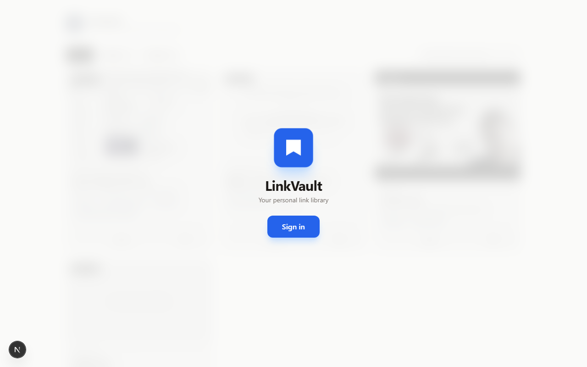
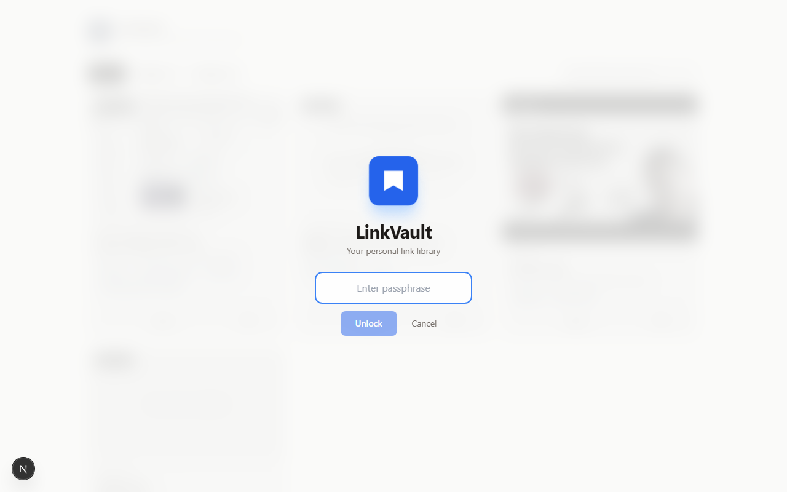
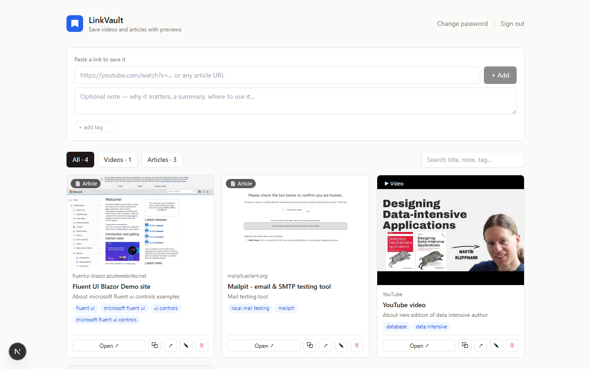
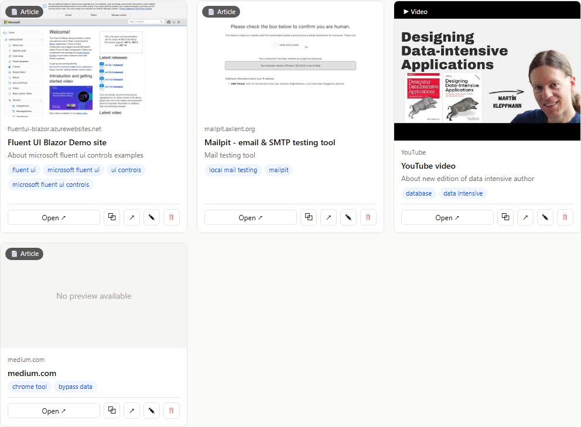

# LinkVault

A personal link-saving site. Paste a URL, it fetches the thumbnail, title, and description automatically; you add a note and tags. Each card has open, copy, share, edit, delete.

- **Stack:** Next.js 14 (App Router, Edge runtime), Tailwind, TypeScript
- **Database:** Neon (serverless Postgres, free tier)
- **Hosting:** Vercel (free tier)
- **Auth:** single shared password (only you can add/edit/delete; viewing is public)

---

## Screenshots

| Landing | Sign in |
|---|---|
|  |  |

**Dashboard — after signing in**


**Link card — open, copy, share, edit, delete**


> Screenshots generated with `node scripts/screenshot.mjs` (requires the dev server to be running).

## What you need

- Node 18+ and npm
- A GitHub account
- A free [Neon](https://neon.tech) account
- A free [Vercel](https://vercel.com) account

---

## 1. Local setup

```bash
npm install
cp .env.example .env.local
```

Open `.env.local` and fill in:

- `DATABASE_URL` — get it from Neon (next step)
- `ADMIN_PASSWORD` — any long random string. Generate one with `openssl rand -base64 32`.

## 2. Create the Neon database

1. Go to https://console.neon.tech and create a project (pick the region closest to you).
2. In the project dashboard, open **Connection Details**.
3. Switch the dropdown to **Pooled connection** (important for serverless).
4. Copy the connection string and paste it as `DATABASE_URL` in `.env.local`.

Then create the `links` table:

```bash
npm run db:init
```

You should see `✓ Database initialised.`

## 3. Run locally

```bash
npm run dev
```

Open http://localhost:3000. Click **Sign in**, enter your `ADMIN_PASSWORD`, then paste a URL.

---

## 4. Deploy to Vercel

1. Push this folder to a GitHub repo.
2. Go to https://vercel.com/new and import the repo.
3. Vercel auto-detects Next.js. **Before** clicking Deploy, expand **Environment Variables** and add:
   - `DATABASE_URL` — same Neon pooled connection string
   - `ADMIN_PASSWORD` — same value you used locally
4. Click **Deploy**. About a minute later you'll have a live URL.

That's it — your site is live. Share the URL with anyone; only you can sign in and add/edit links.

---

## How it works

- The page is server-rendered with `force-dynamic`, so saved links appear immediately after adding.
- `POST /api/links` accepts a URL, then on the server fetches the page HTML and parses `<meta property="og:*">` tags (title, description, image, site_name).
- YouTube is special-cased so thumbnails always work, even if the page can't be scraped.
- The admin password lives in `process.env.ADMIN_PASSWORD`. The browser stores it in `sessionStorage` after you sign in once, and sends it as the `x-admin-password` header on write requests. All read endpoints are public.

## Files

```
app/
  api/links/route.ts          GET (list) + POST (create)
  api/links/[id]/route.ts     PATCH (edit) + DELETE
  page.tsx                    server component, fetches links
  layout.tsx
  globals.css
components/
  LinkVaultApp.tsx            main client UI
  AddLinkForm.tsx             URL + note + tags input
  LinkCard.tsx                preview card with actions
  AdminGate.tsx               password popover
lib/
  db.ts                       Neon client
  metadata.ts                 OG-tag fetcher
  auth.ts                     password check
scripts/
  init-db.mjs                 creates the links table
```

## Customising

- **Add more video hosts** to the auto-detection: edit the `VIDEO_HOSTS` array in `lib/metadata.ts`.
- **Change the look:** colours are in `tailwind.config.js`.
- **Make it multi-user later:** swap `ADMIN_PASSWORD` for proper auth (Clerk, Auth.js with a `links.user_id` column). The schema already supports a clean migration.

## Troubleshooting

- **"Database error" on the page** → `DATABASE_URL` isn't set or `npm run db:init` wasn't run.
- **Vercel build fails on the env check** → you set the env var but didn't redeploy; on Vercel, env var changes need a fresh deploy.
- **Thumbnail missing for a non-YouTube link** → that site doesn't expose an `og:image`. The card still works; it just shows "No preview available".
- **"Password rejected" after deploying** → make sure `ADMIN_PASSWORD` is set in Vercel for the **Production** environment, not just Preview.
