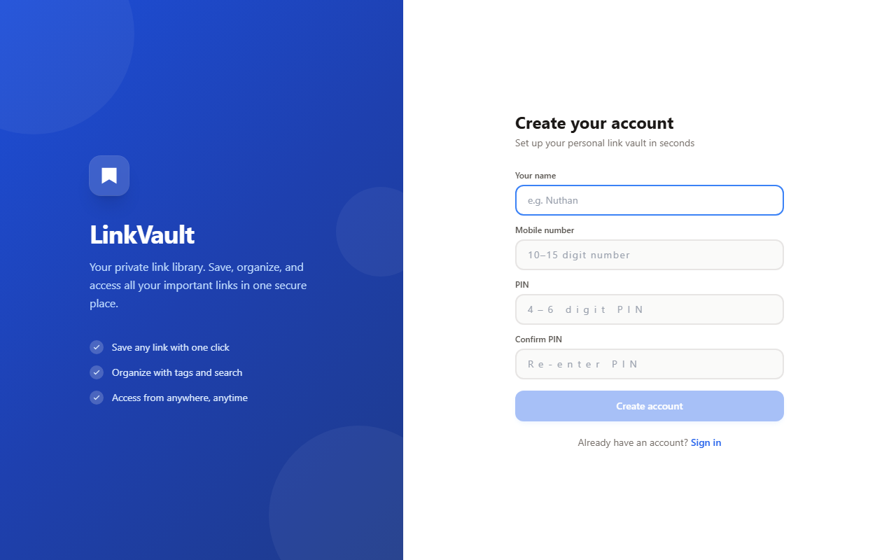

# LinkVault

**LinkVault** is a self-hosted link management app that lets you save, organize, and search URLs with automatic metadata extraction. When you paste a link, it instantly fetches the title, description, and thumbnail image. You can add personal notes and tags for better organization, then easily browse, search, filter, and manage your collection. The app uses mobile number + PIN authentication to keep each user's links completely private and secure.

**In one sentence:** A private, self-hosted bookmark manager that automatically enriches links with metadata and lets you organize them with notes and tags.

| Sign up                                                     | Sign in                                                       |
| ----------------------------------------------------------- | ------------------------------------------------------------- |
|  |  |

## Features in Detail

### Saving Links

1. Paste any URL into the input field at the top
2. Optionally add a personal note to remember why you saved it
3. Add tags for easy organization and filtering
4. Click **Save** — the app automatically fetches metadata (title, description, thumbnail)

### Browsing Your Collection

- View all links as rich cards displaying title, description, thumbnail, and source
- Each card shows the website name and content type badge (video or article)
- Video content is automatically detected for popular platforms

### Search & Filter

- Use the **search bar** to find links by title, description, URL, tags, or notes
- **Filter by type**: View only videos, only articles, or all links
- Tags are fully searchable and clickable

### Link Actions

- **Copy**: Click the copy icon to copy the URL to clipboard
- **Edit**: Update the note or tags on any saved link
- **Delete**: Remove links (with a confirmation to prevent accidents)

### Account Management

- **Change your name**: Update your display name anytime
- **Change your PIN**: Secure your account with a new PIN
- **Sign out**: End your session safely

### Privacy & Security

- Only you can see your links — each user's data is completely isolated
- Authentication via mobile number + PIN ensures only you can access your vault
- No ads, no tracking, no data selling — your links stay private

### Metadata Extraction

- **Open Graph tags**: Title, description, images from the webpage
- **Video detection**: Special handling for YouTube, Vimeo, Twitch, TikTok, and more
- **Fallback images**: Microlink API provides fallback screenshots if OG images aren't available
- **YouTube thumbnails**: Direct fetching ensures YouTube videos always show correct thumbnails

## Use Cases

- **Research**: Save interesting articles and blog posts with personal notes
- **Bookmarking**: Organize all your bookmarks in one searchable vault
- **Learning**: Tag tutorials, courses, and educational resources
- **Content Curation**: Save videos, news articles, and social media content
- **Knowledge Management**: Build a personal knowledge base of useful links

## Video Content Support

The app automatically detects and categorizes content from:

- YouTube (youtube.com, youtu.be)
- Vimeo
- TikTok
- Twitch
- Dailymotion
- Loom
- And more...

Video content gets special treatment for reliable thumbnail fetching.

## Technology Stack Explained

- **Next.js 15 (App Router)**: Modern React framework with edge runtime support
- **TypeScript**: Type-safe development for fewer bugs
- **Tailwind CSS**: Beautiful, responsive UI with utility-first CSS
- **Neon Postgres**: Serverless database that scales with your needs
- **Edge Runtime**: Fast response times, globally distributed

## Database Schema

LinkVault stores three main tables:

- **users**: User accounts (mobile number, name, PIN hash)
- **sessions**: Active user sessions with expiration (30 days default)
- **links**: Saved links with metadata, notes, tags, and timestamps

Each link is tied to a specific user via `user_id`, ensuring complete privacy.

---

## Other Screenshots

**Dashboard**


---

## Requirements

- Node.js 18+
- A PostgreSQL database (we use [Neon](https://neon.tech) - serverless Postgres)
- A Node.js hosting platform (we use [Vercel](https://vercel.com))

## Platform Flexibility Note

✅ **Yes, you can deploy this on your preferred platform!**

We've used Neon for the database and Vercel for hosting, but **LinkVault** is designed to be platform-agnostic. You can choose any PostgreSQL provider and any Node.js hosting service.

## Alternative Deployment Options

#### **Database Alternatives:**

- **PostgreSQL:** [Railway](https://railway.app), [Render](https://render.com), [Supabase](https://supabase.com), [AWS RDS](https://aws.amazon.com/rds/), [DigitalOcean](https://www.digitalocean.com/products/managed-databases/), self-hosted
- **MySQL:** [PlanetScale](https://planetscale.com), [AWS RDS](https://aws.amazon.com/rds/), [DigitalOcean](https://www.digitalocean.com/)
- **SQLite:** Self-hosted or embedded (for small-scale deployments)

#### **Hosting Alternatives:**

- **Node.js Runtime:** [Railway](https://railway.app), [Render](https://render.com), [Fly.io](https://fly.io), [AWS Lambda](https://aws.amazon.com/lambda/), [DigitalOcean App Platform](https://www.digitalocean.com/products/app-platform/), [Heroku](https://www.heroku.com/), self-hosted VPS
- **Containerized:** [Docker](https://www.docker.com/) on any cloud provider

## Required Changes for Alternative Deployment

#### **For a Different Database (PostgreSQL variants):**

1. **Update `lib/db.ts`:**
   - Replace `@neondatabase/serverless` with standard `pg` package
   ```bash
   npm uninstall @neondatabase/serverless
   npm install pg
   ```

## Local setup

**1. Clone and install**

```bash
git clone <your-repo-url>
cd linkvault
npm install
```

**2. Create the database**

1. Go to [console.neon.tech](https://console.neon.tech) and create a project.
2. Open **Connection Details**, switch the dropdown to **Pooled connection**, and copy the connection string.

**3. Configure environment**

```bash
cp .env.example .env.local

copy .env.example .env.local
```

Open `.env.local` and set `DATABASE_URL` to the connection string you copied.

> Tables are created automatically the first time you sign up — no manual migration needed.

**4. Run**

```bash
npm run dev
```

Open [http://localhost:3000](http://localhost:3000), create an account with your mobile number and a PIN, then start saving links.

---

## Deploy to Vercel

1. Push the repo to GitHub.
2. Go to [vercel.com/new](https://vercel.com/new) and import the repo.
3. Before clicking **Deploy**, add one environment variable:
   - `DATABASE_URL` — the Neon pooled connection string
4. Click **Deploy**.

Your app is live. Anyone can visit the URL and create their own account; each person's links are private to them.

---

## How it works

- When you save a URL, the server fetches the page HTML and parses `og:title`, `og:description`, `og:image`, and `og:site_name`. YouTube thumbnails are fetched directly so they always work.
- Auth is mobile number + PIN. On sign-in, the server returns a session token stored in `sessionStorage`. Every request to the API includes that token in the `x-session-token` header.
- All database tables (`users`, `sessions`, `links`) are created automatically on first use via `ensureTables()` in `lib/auth.ts`.
- Links are scoped to the logged-in user via a `user_id` foreign key.

---

## Project structure

```
app/
  api/auth/
    register/route.ts     POST — create account
    login/route.ts        POST — sign in, returns session token
    logout/route.ts       POST — invalidate session
    account/route.ts      PATCH — update name or PIN
    status/route.ts       GET — check if any users exist
  api/links/
    route.ts              GET (list) + POST (save new link)
    [id]/route.ts         PATCH (edit note/tags) + DELETE
  layout.tsx
  page.tsx
  globals.css

components/
  LandingOverlay.tsx      Split-panel signup / sign-in page
  LinkVaultApp.tsx        Main app shell (session state, routing)
  AddLinkForm.tsx         URL + note + tags input
  LinkCard.tsx            Link card with thumbnail and actions
  AccountMenu.tsx         User menu (change name, change PIN, sign out)

lib/
  db.ts                   Neon SQL client + LinkRow type
  auth.ts                 Session lookup, PIN hashing, ensureTables()
  metadata.ts             OG-tag + YouTube thumbnail fetcher

scripts/
  screenshot.mjs          Captures screenshots using Playwright
```

---

## Customising

- **Add video hosts:** edit `VIDEO_HOSTS` in `lib/metadata.ts` to auto-detect more sites as videos.
- **Change colours:** edit the `colors` block in `tailwind.config.js`.
- **Change session length:** edit the `INTERVAL '30 days'` in `ensureTables()` inside `lib/auth.ts`.

---

## Troubleshooting

| Symptom                                  | Fix                                                                                 |
| ---------------------------------------- | ----------------------------------------------------------------------------------- |
| "DATABASE_URL is not set" on startup     | Add `DATABASE_URL` to `.env.local` (local) or Vercel environment variables (prod)   |
| Vercel build fails after adding env var  | Env var changes require a fresh deploy — trigger one from the Vercel dashboard      |
| Thumbnail missing                        | The site doesn't expose an `og:image`. The card still works; it shows a placeholder |
| "Incorrect mobile or PIN"                | Double-check the number and PIN. PIN is case-sensitive to digit order only          |
| Sign up says "mobile already registered" | That number has an account — click **Sign in** instead                              |

---

## Refresh screenshots

The script `scripts/screenshot.mjs` captures screenshots into `public/screenshots`.

### What it captures

1. `signup.png` (landing signup view)
2. `sign-in.png` (sign-in panel)
3. `home.png` (dashboard after login, only when credentials are provided)
4. `link-card.png` (first visible link card, only when at least one link exists)

### Prerequisites

1. Install dependencies:

```bash
npm install
```

2. Ensure Chromium is available for Playwright (run once if needed):

```bash
npx playwright install chromium
```

3. Start the app before running the screenshot script:

```bash
npm run dev
```

### Environment variables

You can provide values either in `.env.local` or directly in terminal.

- `BASE_URL` (optional): defaults to `http://localhost:3000`
- `MOBILE` (optional): mobile number for sign-in
- `PIN` (optional): PIN for sign-in

### Run commands

Auth screens only (no credentials required):

```bash
node scripts/screenshot.mjs
```

Include dashboard and card screenshots (macOS/Linux):

```bash
BASE_URL=http://localhost:3000 MOBILE=<your-number> PIN=<your-pin> node scripts/screenshot.mjs
```

Include dashboard and card screenshots (Windows PowerShell):

```powershell
$env:BASE_URL="http://localhost:3000"
$env:MOBILE="<your-number>"
$env:PIN="<your-pin>"
node scripts/screenshot.mjs
```

### Notes

- If `MOBILE` or `PIN` is missing, the script generates only `signup.png` and `sign-in.png`.
- If login succeeds but the account has no saved links, `home.png` is generated and `link-card.png` is skipped.
- If using a deployed URL (for example Vercel), credentials must belong to that deployment's database.

### Troubleshooting

- Timeout after clicking Sign in: verify `MOBILE`, `PIN`, and `BASE_URL`.
- `link-card.png` skipped: add at least one saved link to the account, then rerun.
